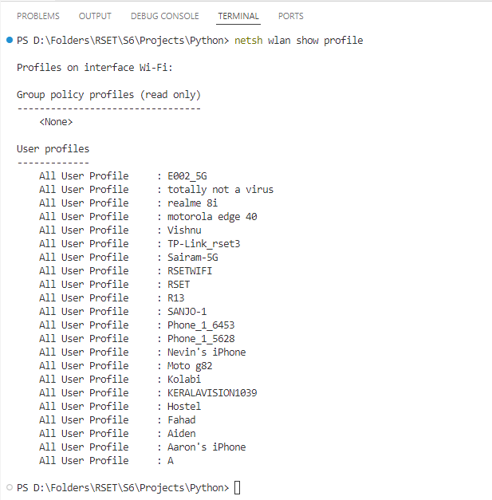
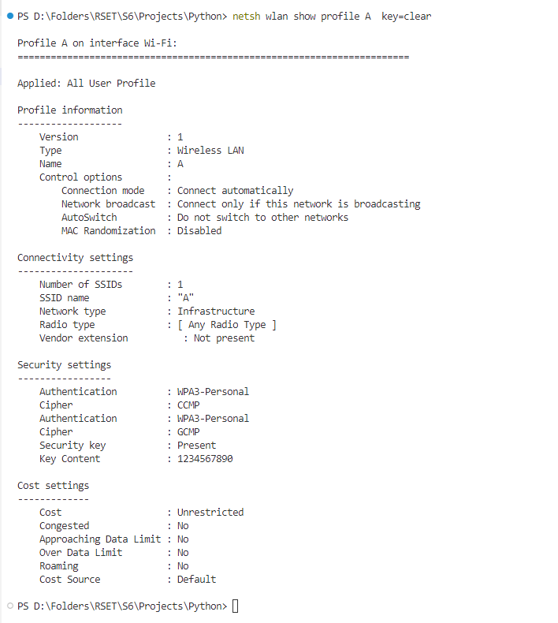
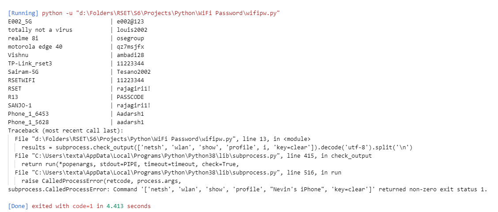

# WiFi Password Finder
This Python script allows you to find WiFi passwords for previously connected networks on your system.

## Introduction
If you've forgotten your WiFi password but have connected to the network before, this script can retrieve it for you. It works by executing commands in the terminal using Python.

**Note**: This script only retrieves passwords for WiFi networks that were previously connected to the system. It cannot find passwords for unknown networks or nearby networks.

## Explanation
To find WiFi passwords, the script runs two commands in the terminal. This requires importing the `subprocess` module in Python, which allows you to spawn a new process.

The two commands used are:
1. `$ netsh wlan show profiles`: This command finds the profiles of all the connected WiFi networks.
2. `$ netsh wlan show profile PROFILE-NAME key=clear`: This command displays the password of a specific WiFi network. Replace PROFILE-NAME with the name of the WiFi profile.

## Outputs
- 
- 
- 

## Credits
This script and README.md document is adapted from the article on [CodeWithCurious](https://codewithcurious.com/projects/find-wifi-passwords-using-python/).
